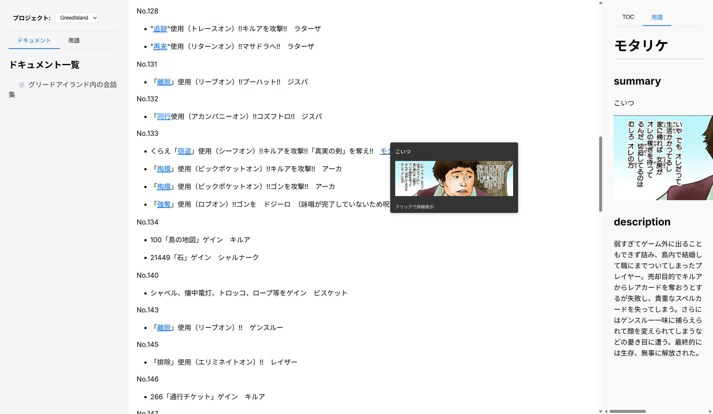

## このアプリについて
- markdownで作った資料を表示する環境
- サブペインに用語情報を表示することで、資料中の用語がよくわからないまま読み進めることなく資料を読む体験を提供する

https://hermit255.github.io/tips-docs/



## 構成要素
### 用語
- 所定のフォーマットで登録することで、ドキュメント閲覧時にtooltipやリンクとして連携する

### ドキュメント
- 用語に対する通常の資料であり議事録・設計書・マニュアルなど特に既定は無い

## 使い方
- `docker compose up` すればNext.jsでサーバーが起動する。http://localhost:3000 から閲覧可能
- プロジェクト単位でドキュメントが管理でき、`projects/{projectName}/docs`(ドキュメントファイル) `projects/{projectName}/terms`(用語ファイル)を元にサービス内でビルドされる

## GitHub Pages デプロイ

このアプリケーションはGitHub Pagesで静的サイトとしてデプロイできます。

### 設定手順

1. **GitHub Pagesの設定**:
   - リポジトリの Settings > Pages に移動
   - Source を "GitHub Actions" に設定

2. **自動デプロイ**:
   - mainブランチにプッシュすると自動的にデプロイされます
   - GitHub Actionsでビルドとデプロイが実行されます

3. **アクセス**:
   - `https://{username}.github.io/{repository-name}` でアクセス可能

### ローカル開発

```bash
# 開発サーバー起動
docker compose up

# 静的ビルド（GitHub Pages用）
npm run build
```
